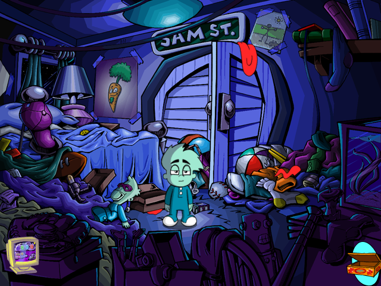

# openyaga

Tools for the **Yaga engine** — the in-house engine Humongous Entertainment and
Atari used for their last adventure games, after two decades of SCUMM.

Yaga games are **not** SCUMM games and ScummVM does not currently run them. Five
titles shipped on it:

- Pajama Sam 4: Life Is Rough When You Lose Your Stuff (2003)
- Putt-Putt: Pep's Birthday Surprise (2003)
- Backyard Basketball 2004, Backyard Football 2004, Backyard Hockey

Development so far has been against Pajama Sam 4.



*Sam's bedroom, rendered by openyaga from the game's own scripts and data, with
the inventory raised.*

## What works today

**`tools/` — asset extraction. Complete and in use.**

Decodes every sprite in the game to PNG: 2,725 animations, 34,091 images, zero
decode failures. Also extracts audio, XML and video, and produces sprite sheets
and animations. See [tools/README.md](tools/README.md).

```bash
python tools/yaga_extract.py sprites --pattern "bedroom/*" --formats frames,sheet
```

**`FORMATS.md` — the format documentation.**

Containers, both sprite codecs, the lipsync/phoneme system, and the quirks in
the shipped data that break naive decoders.

## What doesn't work yet

**`player/` — a standalone player. Early.**

Yaga is a C++ engine driving **Python 2.2** game scripts, which are bundled
inside the game executable. So the game's *logic* needs no reimplementation —
only the engine beneath it. The player reads the scripts out of the copy you
own, then provides the eleven `yaga*` modules they import, backed by SDL.

Currently: the loader works. It finds the executable, unpacks 183 modules,
recovers them as source, and they all parse. Nothing renders yet.

See [player/README.md](player/README.md) for the design and next steps.

## You need your own copy of the game

This repository contains **no game code and no game assets**, and never will.
Everything it produces is derived from the copy on your own machine and stays
there. `.gitignore` denies by default for exactly this reason.

## Prerequisites

| | |
|---|---|
| `tools/` | Python 3, Pillow |
| `player/` setup | Python 3, `uncompyle6` (one-time, per install) |
| `player/` runtime | Python 2.7 + `pygame==1.9.6` — the game's code is Python 2, and converting it would silently change integer division |

## Prior work

- **[cyxx/linyaga](https://github.com/cyxx/linyaga)** — a C wrapper for the Yaga
  games, and the reference that made the sprite formats legible. Note it targets
  a different build than the retail Windows release: that build's scripts import
  eleven object-oriented `yaga*` modules, while linyaga provides a single flat
  `yagahost`.
- **ScummVM's `yaga` branch** ([bluegr/scummvm](https://github.com/bluegr/scummvm/tree/yaga))
  — an engine skeleton with MNG/RLE decoding and game detection, parked at the
  point where the Python interpreter problem starts.

The two projects have different goals from this one. A ScummVM engine must
embed a Python interpreter in C++ to run the original bytecode; this runs the
scripts under CPython instead, which is far less work and correspondingly less
portable. Nothing here is upstreamable to ScummVM — only the knowledge is.

## Licence

MIT, for the code and documentation here. See [LICENSE](LICENSE).

That covers this repository only. Pajama Sam 4 and the other Yaga games remain
the property of their rights holders; nothing of theirs is included here, and
you supply your own copy of the game.
